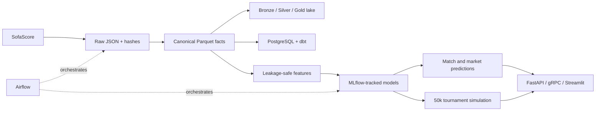

# World Cup Intelligence Platform

[](https://github.com/MalreddyNitin/fifa26wc/actions/workflows/ci.yml)


An end-to-end football data and modeling platform for all 48 World Cup 2026
teams. It ingests historical SofaScore events and advanced statistics, builds
leakage-safe team/opponent features, trains calibrated outcome and count
models, simulates the 48-team tournament, and serves results through REST,
gRPC, and Streamlit.

The repository retains the original exploratory CSV scripts, but the
production path is under `src/world_cup_intelligence`, `scripts`, and
`services`.

## What this demonstrates

- **Data engineering:** resumable API ingestion, immutable raw payloads,
  canonical dimensional/fact models, Parquet lake layers, PostgreSQL/dbt
  marts, Airflow orchestration, and Spark parity checks.
- **Data science:** time-aware validation, leakage-safe rolling features,
  calibrated classification and count models, Elo baselines, model cards,
  drift monitoring, and probabilistic tournament simulation.
- **Analytics engineering:** documented grain and lineage, source-to-target
  reconciliation, dbt tests, coverage reporting, and explicit missing-data
  semantics.
- **Production delivery:** FastAPI, gRPC, Streamlit, Docker Compose, MLflow,
  CI, Kafka/Redis live-data contracts, and infrastructure-as-code.

## Current scale

- 48 registered tournament teams
- 9,709 deduplicated historical matches from 1950 onward
- immutable raw payloads with SHA-256 hashes and run metadata
- one-row match and two-row team-match canonical facts
- rolling 3/5/10, EWM, volatility, trend, opponent, and Elo features
- outcome, scoreline, shots, shots-on-target, and corners model pipelines
- 50,000-run 48-team tournament simulator

Advanced-stat coverage varies by era and is reported explicitly. Unsupported
statistics are null, never silently converted to zero. SofaScore-displayed
rankings are retained as source fields but are not treated as historical FIFA
rankings.

## Quick start

```powershell
python -m pip install -e ".[dev,models,api,dashboard,warehouse]"
pytest
```

Run a small end-to-end build (this contacts the public SofaScore endpoint):

```powershell
python scripts/run_platform.py --demo
```

To fetch or refresh source data:

```powershell
python scripts/run_batch_pipeline.py
python scripts/run_statistics_pipeline.py
```

Both jobs are resumable and content-addressed.

## Local services

```powershell
docker compose up -d
```

| Service | Address |
|---|---|
| Prediction API | `http://localhost:8000` |
| API docs | `http://localhost:8000/docs` |
| Streamlit | `http://localhost:8501` |
| MLflow | `http://localhost:5000` |
| MinIO console | `http://localhost:9001` |
| Airflow | `http://localhost:8088` |
| Spark master | `http://localhost:8080` |

The optional live profile adds Kafka and Redis:

```powershell
docker compose --profile live up -d
```

## Public Streamlit deployment

The hosted app can run as a single process: when `API_BASE_URL` is unset,
Streamlit performs inference in-process from a compact deployment bundle. The
local Docker stack continues to route predictions through FastAPI.

```powershell
python scripts/build_deployment_bundle.py
streamlit run services/streamlit/app.py
```

For Streamlit Community Cloud, select this repository, the `main` branch, and
`services/streamlit/app.py` as the entrypoint. `requirements.txt` installs the
application dependencies. The checked-in deployment bundle contains only the
minimum historical features and two small trained estimators required for
inference; the raw lake and full feature matrices remain excluded.

## Predict from a SofaScore match link

Open the Streamlit **Match predictor** tab and paste the public match-page URL,
normally ending in `#id:12345678`. The API fetches the two teams, kickoff,
competition, round, venue, city/country, displayed rankings, and neutral-ground
context from SofaScore before constructing the leakage-safe feature row.

```powershell
$body = @{
  sofascore_url = "https://www.sofascore.com/football/match/...#id:12345678"
} | ConvertTo-Json

Invoke-RestMethod `
  -Method Post `
  -Uri http://localhost:8000/v1/predict-sofascore-link `
  -ContentType application/json `
  -Body $body
```

Only event metadata is fetched. Current-match scores and statistics are never
used in the pre-match feature row. The stadium is returned for display and
auditability; it is not a model input because the current trained feature
schema has no high-cardinality stadium-name feature. Links containing teams
without trained history return a clear validation error.

## Pipeline



## Repository map

| Path | Purpose |
|---|---|
| `src/world_cup_intelligence/` | Canonical modeling, feature, training, inference, simulation, and monitoring library |
| `scripts/` | Reproducible batch entry points |
| `services/` | FastAPI, gRPC, and Streamlit applications |
| `airflow/`, `spark/`, `streaming/` | Batch and live orchestration workloads |
| `dbt/`, `warehouse/` | Analytics warehouse models, tests, and load jobs |
| `tests/` | Unit and integration-focused correctness tests |
| `docs/`, `reports/` | Architecture, lineage, model evaluation, and operational evidence |
| `infrastructure/` | Optional GCP and local object-storage configuration |

## Key commands

```powershell
python scripts/build_canonical_and_features.py
python scripts/materialize_lake.py
python scripts/load_warehouse.py
dbt build --project-dir dbt --profiles-dir dbt
python scripts/train_models.py
python scripts/simulate_tournament.py --simulations 50000
python scripts/run_monitoring.py
```

## Quality and reproducibility

```powershell
ruff check src scripts tests services
ruff format --check src scripts tests services
pytest
docker compose config --quiet
dbt parse --project-dir dbt --profiles-dir dbt --no-partial-parse
```

Tests cover canonical grain and reconciliation, leakage-safe rolling logic,
statistics parsing, percentage bounds, odds/EV math, score-matrix consistency,
group ranking, all valid third-place assignments, streaming idempotency, and
drift utilities.

Large raw responses, generated Parquet feature tables, trained binaries,
MLflow state, and checkpoints are intentionally excluded from Git. They are
reproducible through the documented scripts; only lightweight templates and
evaluation reports are versioned. See [`data/README.md`](data/README.md).

See [architecture](docs/architecture.md), [data lineage](docs/data_lineage.md),
[canonical dictionary](docs/canonical_data_dictionary.md), [model cards](docs/model_cards),
and [limitations](docs/limitations.md). The 48-team registry was checked
against FIFA's [qualified teams page](https://www.fifa.com/en/tournaments/mens/worldcup/canadamexicousa2026/articles/world-cup-2026-who-has-qualified).
