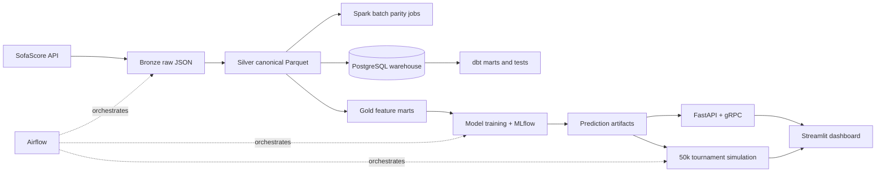
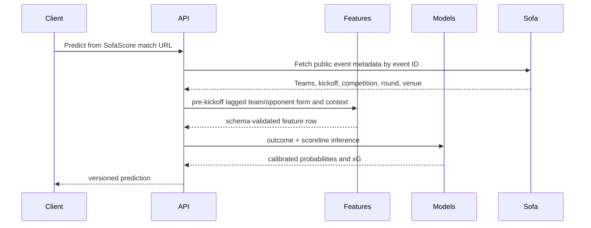

# Architecture

Local development uses content-addressed files and PostgreSQL so the entire
batch platform is demonstrable without cloud credentials. MinIO mirrors the
S3-compatible lake contract. Spark implements the distributable reference
jobs; pandas remains the validated implementation at the current data scale.

## Service sequence

